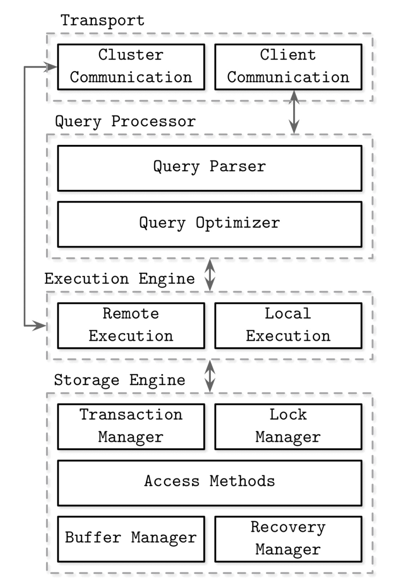

# 파트 I. 스토리지 엔진

- DBMS의 목표는 아래와 같음
  - 데이터를 안정적으로 저장하고
  - 사용자가 이용할 수 있게 하는 것
- DBMS는 DB를 데이터 소스로 사용함
  - DBMS와 DB의 차이가 헷갈릴 수 있음
  - 데이터베이스(DB)는 구조화된 데이터의 집합임
    - 결제 내역, 학생 정보 등의 모음이 DB임
  - 데이터베이스 관리 시스템(DBMS)은 이 데이터를 생성 / 조회 / 수정 / 삭제할 수 있게 해주는 시스템
    - MySQL, PostgreSQL 같은 것들이 DBMS임
  - 이렇듯 엄밀하게 보면 DBMS와 DB는 다르지만, 편의상 우리는 DBMS를 DB로 많이 부름
    - 너 DB 공부 뭐해? → 나 MySQL 공부해
  - 이 책에서는 DBMS라는 표현이 좀 길고 번거롭기 때문에 DBMS를 DB라는 용어로 지칭할 것임

---

- 데이터베이스는 모듈식 구조임
  - 전송 계층 → 요청을 받음
  - 쿼리 프로세서 → 쿼리를 실행할 방법을 결정
  - 실행 엔진 → 실제로 작업을 수행
  - 스토리지 엔진 → 데이터를 저장하고 관리
- 각각의 모듈은 각자의 관심사에 따른 역할을 수행함
- 스토리지 엔진(== 데이터베이스 엔진)은 위에서 말했듯 DBMS의 구성 요소 중 하나
  - 메모리와 디스크에서 데이터 저장 / 검색 / 관리하는 책임
  - 각 노드의 영구적 / 장기적 메모리를 유지하도록 설계
- DB는 복잡한 쿼리에 응답할 수 있음 ↔ 스토리지 엔진은 더 세부적인 데이터를 다루며 / 간단한 데이터 조작 API를 제공
- 스토리지 엔진 → 실제로 InnoDB 보면 단순한 CRUD API로 구성되어 있음

  ```c
  // InnoDB, btr0cur.cc

  // 레코드 삽입 (CREATE)
  btr_cur_optimistic_insert(
      0,                   // 플래그
      cursor,              // B-tree 커서
      &offsets,            // 레코드 오프셋
      &heap,               // 메모리 힙
      entry,               // 삽입할 레코드
      &rec,                // 삽입된 레코드에 대한 포인터
      &big_rec,            // 대용량 레코드 필드
      n_ext,               // 외부 필드 수
      thr,                 // 쿼리 쓰레드
      &mtr);               // 미니 트랜잭션

  // 레코드 검색 (READ)
  btr_cur_search_to_nth_level(
      index,               // 인덱스
      0,                   // 레벨
      tuple,               // 검색 키
      PAGE_CUR_LE,         // 커서 위치 모드
      BTR_SEARCH_LEAF,     // 검색 모드
      &cursor,             // 결과 커서
      0,                   // 검색 문자열
      file,                // 파일
      line,                // 라인
      &mtr);               // 미니 트랜잭션
  ```

  - DB는 스토리지 엔진의 이런 저수준 기능을 활용하여 추가적인 고수준 기능을 제공함
  - 이러한 고수준 기능에는 스키마 / 쿼리 언어(SQL) / 인덱싱 / 트랜잭션 등이 있음
  - 복잡한 쿼리 상황에서는 이런 고수준 기능이 사용됨
  - “DB는 복잡한 쿼리에 응답할 수 있음” 이라는 표현은 이런 맥락에서 나온 것

---

- 스토리지 엔진은 값이 어떤 데이터 타입을 가지고 있는지 신경쓰지 않음
  - 스토리지 엔진 입장에서 어떤 데이터 타입이든 그냥 바이트 시퀀스일 뿐임
  - 예시에서 볼 수 있듯이 정수 1001에 대하여 이메일 문자열에 해당하는 엔트리가 있다면, 스토리지 엔진은 정수고 이메일이고 신경쓰지 않고 그냥 바이트 시퀀스로 변환해서 저장함
- 이렇게 데이터를 바이트 스트림으로 변환하는 걸 직렬화라고 함
  - 즉 스토리지 엔진은 직렬화된 바이트 스트림만을 다루고 / 스토리지 엔진의 상위 레벨에 있는 DBMS 구성 요소가 이 바이트 스트림의 의미를 결정함 → “그들의 정렬 및 표현 의미론은 상위 레벨 서브시스템에서 정의됩니다.”
- “유연성을 위해 키와 값 모두 정해진 형식 없이 임의의 바이트 시퀀스가 될 수 있습니다” → 어떤 유연성을 위해서? 그건 바로 아래에서 설명

---

- BerkeleyDB, LevelDB와 그 후손들에 해당하는 스토리지 엔진들은 DBMS와 독립적으로 개발됨
  - 이 내용이 바로 이어져서 나오는 것을 보아 ‘유연성’ → ‘스토리지 엔진의 유연한 교체’를 의미하는 걸로 보임
  - 물론 ‘다양한 데이터 타입을 지원하는 유연성’으로 해석할 수도 있을 듯
- 이런 걸 플러그형 스토리지 엔진이라고 하는데, 이걸 쓰면 DBMS를 쉽게 구축(부트스트래핑)할 수 있고, 스토리지 엔진에 신경 안 쓰고 다른 부분에 더 집중할 수 있음
  - 일종의 관심사의 분리라고 볼 수 있음 + 바이트 스트림만을 처리하는 것 역시 관심사의 분리!
- 이렇게 DBMS가 모듈식으로 분리되어 있어서 스토리지 엔진도 플러거블하게 교체할 수 있다는 점 때문에 생기는 이점이 있음 → 바로 우리의 워크로드(~= 작업 발생 패턴)에 맞는 스토리지 엔진을 쓸 수 있다는 것.
  - 비즈니스마다 유즈케이스가 다름. 유즈케이스가 다르다면 DB에서의 워크로드 역시 다르게 나타날 것.
  - 가령 MySQL의 경우 InnoDB가 기본이고, ACID와 제약 조건 등으로 무결성 등을 보장해야 하는 대부분의 유즈케이스에 적합함.
  - 한편 MyISAM도 있는데, 트랜잭션 미지원 대신 빠른 읽기가 중요해서, 성능이 중요한 경우 해당 스토리지 엔진을 고려할 수도 있음
  - RocksDB/MyRocks의 경우 쓰기 집약적 워크로드에 최적화 되어있음. LSM 트리 구조라서 대량의 쓰기 작업에 적합함
  - MongoDB의 경우 WiredTiger가 기본. 문서 레벨의 동시성 제어 (락) / 압축 기능 제공.
  - In-Memory도 가능 → 모든 데이터를 메모리에 저장함. 읽기 / 쓰기 매우 빠름. but 재시작하면 데이터 날아감. 캐시나 임시 데이터에 적합
  - MMAPv1 → 지금은 안 씀

## 파트 I. 데이터베이스 비교

- 잘못된 데이터베이스 선택은 오랫동안 우리를 괴롭힐 수도 있음
- 그래서 성능 / 일관성 / 운영 어려움 이슈 있다면, 조기에 파악해야 함
- 운영 이후에 DBMS를 마이그레이션하는 건 어렵고, 애플리케이션 코드의 경우 (아무리 추상화를 잘 하더라도) 특정 DB에 의존적인 로직이 있을 수 있기 때문에… 애플리케이션 코드도 바꿔야 할 수 있음
- 이러한 위험을 회피하기 위해서는 DBMS를 결정하기 전에 미리 시간을 투자해야 함

---

- 아래와 같은 기준에 따라 결정하면 잘못된 결론에 도달할 수 있음
  - 어떤 DBMS 구성 요소를 가지는지 (스토리지 엔진, 공유, 복제, 부산)
  - 인기도 (ex: 요즘 이게 핫하더라)
  - 구현 언어 (ex: C가 빠르니까 C로 구현된 DB를 써야지)
- 그럼 어떻게? → 각 DB 내부 작동 원리 이해하기. 간단하게만 알더라도 아주 도움 많이 됨

---

- 비교할 때는 기준이 중요함. 목표가 뭔지?
  - 우리 서비스에 이미 존재하는 워크로드가 있거나 없다면 예상 워크로드를 만들 수 있음
  - 이를 기반으로 다양한 DBMS에 대해 테스트를 돌려보고
  - 성능 메트릭 결과를 비교하면 된다
  - 이때 중요한 점 → 성능, 확장성 문제는 시간 / 용량이 지난 후에 발생하기 때문에, 테스트라고 해서 그냥 가볍게 돌리는 게 아니라, 프로덕션 환경과 최대한 비슷하게 구성해야 함!
- 이렇게 테스트를 하다 보면, 단순히 성능 뿐만이 아니라 DBMS 운영 방법, 디버깅, 커뮤니티 활성도도 같이 알 수 있음. 이런 것도 중요한 지표임
  - DBMS를 비교할 때 성능이 가장 중요한 지표가 아닐 때도 있음
  - 데이터를 빠르게 저장하고 빠르게 잃어버리는 DB vs 데이터를 느리게 저장하고 느리게 잃어버리는 DB
  - 결제가 0.001초만에 끝나는 대신 1% 확률로 내 돈만 날라가고 물건은 안 오는 시스템 vs 결제 10분 걸리지만 100% 성공하는 시스템
  - 둘 다 싫긴 한데 당연히 후자가…
  - ‘하지만 빨랐죠?’ 는 좀 그럼
  - 책에서는 그렇게 말하긴 하지만, 안 그런 경우도 있다고 봄 → ‘미션 크리티컬’한 경우
    - 10초 뒤에 폭탄이 터지는데 DB 어딘가에 정보가 있음
    - 60초 걸려서 100% 정확한 답을 가져오는 DB vs 5초 걸려서 50% 확률로 오답인 답을 가져오는 DB
    - 전자는 100% 죽으니까…
- 데이터베이스 비교 시 이런 변수들을 봐야 한다고 한다
  - **스키마와 레코드 크기**
  - **클라이언트 수**
  - **쿼리 유형과 접근 패턴**
  - **읽기 및 쓰기 쿼리의 비율**
    - 보통은 읽기가 쓰기보다 많음. 쇼핑몰 생각해보자. 글 쓰는 사람이 많을까, 상품 보는 사람이 많을까?
    - 하지만 아닌 경우도 있음 → 앞에서 말했던 ‘쓰기 집약적 워크로드’.
    - 읽기 / 쓰기 비율 DBMS 결정할 때 굉장히 중요함.
  - 이러한 변수들의 예상 변화
- 이를 기반으로 이런저런 질문에 답할 수 있다는데… 스킵
- 책에서 언급되는 변수들 기반으로 우리 서비스의 유즈케이스를 잘 이해해야 한다
- 대부분의 DB에는 유즈케이스를 테스트할 수 있는 스트레스 툴이 있다. 없다면 특이한 DB를 쓰는 거라서, 생각을 좀 해보는 게 좋다

---

- 데이터베이스 내부 구현에 대한 코드베이스를 찾아보면 좋다 (이 정도까지? 싶다…)
- 그래야 DB 이해도를 올리고 / DB 자체의 문제가 발생한 경우에 도움이 된다
- DB를 그냥 블랙박스로 쓰면 좋겠지만, 결국은 버그 / 중단 / 성능 저하 등의 문제가 발생하여, 데이터베이스 내부를 봐야 하는 상황이 온다.
  - 개인적으로는 이 글([https://tech.devsisters.com/posts/bit-level-database-hacking/](https://tech.devsisters.com/posts/bit-level-database-hacking/))이 생각났다.

## 파트 I. 트레이드오프 이해하기

- DB 사용자의 입장에서, 우리는 구현된 DB가 다양한 조건에서 어떻게 작동하는지 관찰해볼 수 있다.
  - 가령 쿼리를 실행할 때 이 조건에서는 빠르네? 저 조건에서는 느리네? 같이…
    - 즉 DB가 어떻게 작동하는지는 보이지만, 왜 그렇게 작동하는지는 알기 어렵다.
- DB 개발자의 입장에서는 이 동작이 왜 그렇게 되는지를 직접 의사결정하고 구현해야 함
  - 이러한 구현은 단순히 교과서 B-Tree 자료 구조 구현하는 정도의 수준이 아님. 더 복잡함.
  - 초기 레벨에서 결정하기 어려운 구현 세부사항과 엣지 케이스가 있음
  - 저장 방식, 인덱싱 구조, GC 방식, 시멘틱스, 동시성 환경, 안정성, …
- 이러한 결정을 내릴 때 ‘트레이드오프’를 고려해야 함 → 수많은 결정이 있고, 각각의 장단점이 있음
  - 쓰기 성능 vs 읽기 성능
- 따라서 다양한 스토리지 엔진에는 장단점이 있음 → 모든 유즈케이스에 최적인 ‘만능’ 스토리지 엔진 같은 건 없음. 그래서 우리의 워크로드와 유즈케이스에 맞게 현명한 선택을 내려야 함
- 각각의 스토리지 엔진 개발자가 내린 의사결정과 그로 인한 스토리지 엔진 간 장/단점 간 차이는, 우리가 다양한 환경에서도 그에 최적화된 선택을 내릴 수 있게 만들어 준다.
  - 어떤 것은 빠른 읽기, 어떤 것은 빠른 쓰기, 어떤 것은 데이터 크기, 어떤 것은 운영 용이성, …

# Chapter 1. Introduction and Overview

- DBMS는 다양한 목적에 맞춰서 설계됨
  - 자주 접근되는 핫 데이터 (캐시, 실시간 위치)
  - 장기 보관이 필요한 콜드 데이터 (로그, 백업)
  - 복잡한 분석 쿼리
  - 단순 키-값 조회 (Redis)
  - 시계열 데이터 → 시간의 흐름에 따라 순차적으로 수집된 데이터. Prometheus
  - BLOB (대용량 바이너리 데이터)
- DB는 다양하고 복잡한 용어를 가지고 있음
  - 컬럼 스토어 vs 와이드 컬럼 스토어
  - 클러스터드 인덱스 vs 인덱스 조직 테이블
- 이 챕터에서는 각 DBMS에서 쓰이는 용어의 정확한 정의를 이해할 것임
- DBMS 아키텍처 → 각 시스템 구성요소 및 역할 → 저장 매체 관점에서의 DBMS 차이 → 레이아웃 관점에서의 컬럼 지향 vs 로우 지향 시스템 차이 순으로 다룰 것
- 위의 저장 매체 / 레이아웃 말고도 더 많은 분류 방식이 있음
  - OLTP / OLAP / HTAP 방식도 존재
- 그 외에도 키-값 저장소, 관계형 DBMS, 문서 지향 저장소, 그래프 DBMS 등등 다양한 용어가 있음. 이러한 개념은 알고 있다고 가정함.
- 1부에서는 이러한 고수준 개념은 알고 있다고 가정하고 저장 및 인덱싱 구조를 메인으로 다룰 것임
- 왜? 어떤 시스템이든 내부적으로 데이터를 저장하고 접근하는 공통된 기술이 있기 때문이고, 이 책은 이에 대해서 다루기 때문. 특정한 DBMS를 아는 것이 아니라…
- 마지막으로 ‘버퍼링, 불변성, 정렬’ 세 개념을 다룰 것. 효율적인 저장 구조를 개발하는 데 도움이 된다.

## DBMS 아키텍처

- DBMS는 ‘시스템’이고, ‘시스템’은 각각의 구성 요소(모듈)들로 이루어짐
- 하지만 모든 DBMS를 아우르는 공통 컴포넌트들은 없음
- DBMS의 모듈이 이론 상으로는 각각의 경계를 가지고 구분되기는 하지만, 실제 구현에서는 강결합(coupling)되어 있는 경우가 많음 → 이는 성능, 엣지 케이스, 아키텍처적인 결정 등의 이유로 인한 것
- DBMS를 설명하는 참고 문헌들이 있음. 이 참고 문헌마다 각기 다른 관점에서 DBMS 구조를 바라보고 있음.
  - 아마 ‘기초데이터베이스’ 전공을 배운 분들에게 익숙한 도식이 있을 것임. 하지만 이 책에서는 다양한 연구에서 공통적인 부분만 추려서 만든 책의 도식을 사용할 것임
    
- 모든 DBMS가 이 구조구나! 가 아니라, 일반적으로 이런 구조를 생각하면 되겠구나- 라고 보면 됨

---

- DBMS는 클라이언트-서버 모델을 사용함. DBMS 인스턴스는 서버 역할, 애플리케이션 인스턴스(ex: 백엔드 서버)는 클라이언트 역할을 함
- ‘트랜스포트’ 서브시스템이 하는 역할
  - 클라이언트로부터 요청을 받음 (대개는 쿼리 언어(ex: SQL) 형태의 요청)
  - 필요한 경우, DBMS 클러스터 내 다른 노드들과 통신하여 요청을 분산 처리
  - ‘쿼리 프로세서’ 로 전달
- ‘쿼리 프로세서’ 서브시스템이 하는 역할
  - 파싱 → 신택스 체크
  - 해석 → 뭘 요구하는지 이해
  - 유효성 검사 → 시맨틱스 체크 (테이블 / 컬럼 실제 존재, 논리적 문제 없는지 확인)
  - 접근 제어 → 이 셋 다음에 해당 사용자의 쿼리 수행 권한 검사.
    - 왜 앞의 세 단계가 끝나야만 가능한가? → 이 테이블 / 컬럼이 존재하는지 알아야, 그 사용자가 해당 데이터에 대한 접근 권한이 있는지 판단 가능하니까.
  - 이후 쿼리 옵티마이저로 전달
  - 즉 쿼리 실행 전 전처리 단계를 수행한다고 보면 됨
- ‘쿼리 옵티마이저’
  - 쿼리를 실제로 실행할 때 가장 빠르고 효율적인 방법을 선택함.
  - 같은 쿼리라도 실행 방식에 따라 성능이 달라질 수 있음 (조인 순서나, 인덱스 사용 여부) → 수많은 실행 계획 중에 가장 좋은 것을 선택
  - 주요 기능
    - 불필요한 중복 기능 제거 (항상 false인 where 절)
    - 내부 통계 및 데이터 배치 기반 판단
      - 인덱스 카디널리티
      - 데이터 배치 (어느 노드에 데이터가 있는지)
      - 전송 비용 (네트워크 타는 비용)
    - 관계형 연산 → SQL 연산을 실행 계획 트리 형태로 표현
    - 최적화 → 어떤 인덱스 쓸 것인지, 어떤 순서로 join할 것인지, join 방식은 어떻게 할 것인지(NL Join, Hash Join), 접근 방식 선택(테이블 풀 스캔 vs 인덱스)
- 실행 계획
  - 위에서 언급했듯이 쿼리는 실행 계획 (혹은 쿼리 계획) 이라는 형태로 표현됨 → “쿼리 결과를 완전히 얻기 위해 수행해야 할 작업들의 순서”
  - 어떤 인덱스를 쓰고, 어떤 순서로 데이터를 읽고, 어떤 연산을 언제 할지를 단계적으로 명시
    - 왜 실행 계획이 필요할까?
    - SQL은 선언형 언어이기 때문에 “무엇을 원한다”만 말할 뿐 “어떻게 처리하라”는 지시가 없음
    - DBMS는 이 선언을 실행 가능한 절차로 바꾸는 것이 필요하고, 그 결과가 바로 실행 계획
      - 가령 A 테이블과 B 테이블을 조인하는 쿼리의 경우
      - 먼저 A를 읽고 B를 조인할 수도 있고,
      - 반대로 B를 먼저 읽을 수도 있음
      - 혹은 전체 테이블을 스캔할 수도 있고, 인덱스를 사용할 수도 있음
      - 이 선택에 따라 쿼리 실행 속도가 초 단위 ↔ 밀리초 단위로 바뀔 수 있음
    - 옵티마이저는 가능한 실행 계획들을 시뮬레이션하고, 그 중에서 가장 비용이 적은 경로를 선택
- 실행 엔진
  - 옵티마이저가 만든 실행 계획을 실제로 수행함
  - 로컬 실행(DB 인스턴스 내에서의 처리)와 원격 실행(다른 노드와의 통신, 분산 시스템 케이스. 다른 클러스터에서 읽기나 레플리카 읽기 같은 경우) 모두 담당

---

- 스토리지 엔진
  - (클라이언트 / 다른 노드로부터 오는) 로컬 쿼리를 실행함
  - 스토리지 엔진은 여러 구성 요소로 이루어져 있음
  - 데이터를 직접 읽고, 쓰고, 수정하는 저수준 연산을 담당함
- 트랜잭션 매니저
  - 데이터베이스를 일관된 상태로 유지 → 트랜잭션 롤백. One or Nothing
- 락 매니저
  - 동일한 데이터를 동시에 수정하려는 트랜잭션 간 충돌을 방지하기 위해 락을 적용
  - 공유 락, 배타 락, …
- 엑세스 메서드
  - 스토리지 엔진이 데이터를 어떻게 디스크데 저장하고 어떻게 빠르게 접근할 수 있게 만들 것인가를 담당
  - DBMS의 저장 구조(힙 파일, B-Tree, LSM Tree)에 따라 달라짐
- 버퍼 매니저
  - 디스크에서 읽은 데이터를 메모리에 임시 저장(버퍼링)하여, 반복 디스크 접근 없이 빠르게 재사용할 수 있게 함
  - 디스크는 일반적으로 데이터를 블록 단위(4KB, 8KB) 단위로 읽음 → DBMS에서는 ‘페이지’라고 부름
  - 왜? → 디스크 IO는 메모리 대비 수십~수백 배 느림. 자주 접근하는 데이터를 디스크에서 읽는 것은 비효율적이므로, 이를 메모리에 유지하는 것.
- 리커버리 매니저
  - 장애가 발생했을 때 데이터를 일관되고 안전한 상태로 되돌림
  - 작업 수행 중 어떤 일이 발생했는지를 로깅하고, 문제 발생 시 이를 기반으로 복구함
  - 어떻게?
    - DBMS는 쓰기 작업 전 해당 작업을 로그에 먼저 기록(WAL)함
    - 시스템 중단 시 이 로그를 다시 읽어서 → 완료된 트랜잭션은 커밋, 중간까지 갔다가 미완료된 트랜잭션은 롤백
  - 체크포인트 → 로그 전체를 재실행하면 손해이므로, 특정 시점의 스냅샷을 저장하여 불러와서 처리
- 트랜잭션 매니저와 락 매니저는 동시성 제어를 담당
  - 여러 사용자가 DB에 접근할 때 데이터 정확성 / 일관성을 보장하면서 + 효율적으로 실행되도록 함
  - 트랜잭션 관리자는 → 작업의 시작 / 종류, 커밋 여부 관리
  - 락 관리자는 → 중복된 접근을 막아줌

## 메모리 기반 vs 디스크 기반 DBMS

- DBMS는 데이터를 메모리 / 디스크에 저장
- 인메모리 DBMS는 ‘주로’ 메모리에 저장하고, 디스크는 복구 / 로깅 용도로 사용
- 디스크 기반 DBMS는 ‘주로’ 디스크에 저장하고, 메모리는 캐시 / 임시 저장 용도로 사용
- 어느 한 쪽만 사용하는 것 아님
- 메모리는 디스크보다 빠름
  - RAM는 수십 ~ 수백 나노초, 디스크는 수 밀리초
  - 실시간 처리, 캐시 등에 적합
- 하지만 RAM은 비쌈. 디스크는 저렴하고 대량 저장에 적합함
- 즉 트레이드오프 존재 → 성능이 필요하면 RAM, 안정성과 비용이 중요하면 디스크, 보통은 둘 다
- 메모리 기반 DB의 목적 → 성능 향상, 낮은 접근 비용, 세분화된 접근 단위 확보
- 메모리 기반 DB 구현이 디스크보다 단순한 이유 → OS가 메모리 관리(할당 / 해제)를 추상화해줘서
- 디스크 기반 DB는 데이터 참조 / 직렬화 형식 / 해제된 메모리 / 단편화 등을 수동으로 관리해야 함 (운영체제 관련 개념)
  - 데이터 참조 → 메모리처럼 포인터로 바로 접근 안됨. 페이지 테이블 등을 통해 논리 주소를 물리 블록 번호로 변환해야 함
  - 직렬화 형식 → 데이터를 바이트 스트림으로 어떻게 변환할 것인지? 불변 길이 / 가변 길이 데이터 타입, 엔디안 고려해야 함. 또, 이러한 데이터 타입의 스키마 역시 변할 수 있으므로 버저닝 관리 필요
  - 해제된 메모리 (free space) → 레코드 삭제 / 업데이트 후 빈 공간 추적하고 재활용해야 함.
  - 단편화 (fragmentation)→ 외부 단편화 (빈 영역이 흩어져 삽입 시 큰 블록 확보 어려움), 내부 단편화 (페이지 단위 할당 시 작은 레코드 뒤에 남는 여유 공간 낭비) 로 인해, 재조직화 / 컴팩션 작업 주기적으로 돌려야 함
- 인메모리 데이터베이스 성장 제약 요인
  - RAM 휘발성
    - 전원이 끊기면 메모리 내용이 모두 사라짐
    - ex) 전원 장애 시 메모리 기반 시스템은 저장 중이던 데이터 전부 손실 가능
  - 비용
    - RAM 단가는 SSD/HDD 대비 여전히 높음
    - 대규모 데이터를 메모리에 모두 올리려면 비쌈
- 내구성 부족 문제
  - ACID 중 Durability(내구성) 속성 확보가 어려움
  - 소프트웨어 오류, 시스템 크래시, 하드웨어 결함 등이 복구 불가능한 데이터 손실로 연결
- 내구성 보장 방법
  - 무정전 전원 장치(UPS) 도입 → 전원 공급 차단돼도 일정 시간동안 유지)
  - 배터리 백업 RAM 사용
  - 단점: 추가 하드웨어 비용 발생, 운영·설정·모니터링을 위한 전문 지식 요구
- 디스크 기반 DB의 장점
  - 비휘발성 매체로 전원 장애에도 데이터 보존
  - 하드웨어 관리·교체가 비교적 용이 (NAS)
  - GB당 단가가 RAM보다 크게 저렴해 대용량 저장에 경제적임
- 흔히 DRAM 과 같은 휘발성 메모리의 문제를 해결하기 위한 NVM (비휘발성 메모리) 기술이 있음
  - NVM에 해당하는 장치에는 플래시 메모리가 있음. 플래시 메모리의 한 종류가 SSD인데, SSD를 알아보다 보면 NVMe라는 프로토콜이 등장함. 그 NVM이 이 NVM임.
  - 읽기 / 쓰기 지연시간 비대칭을 줄이거나 / 제거할 수 있음
  - 바이트 주소 지정 접근이 가능하다고 함 (↔ 블록 단위)

### Durability in Memory-Base Stores

인메모리 데이터베이스 시스템은 내구성을 보장하고 휘발성 데이터 손실을 방지하기 위해 디스크에 백업을 유지합니다. 일부 데이터베이스는 내구성 보장 없이 오직 메모리만을 사용하여 데이터를 저장하지만, 본 책의 범위에서는 다루지 않습니다.

- 인메모리 DBMS의 Durability
  - 인메모리의 휘발성 데이터 보호를 위해 디스크에 복제본을 저장함
  - 전원 장애나 시스템 오류 발생 시 디스크 백업으로 데이터 복구 가능

작업이 완료되었다고 간주되기 위해서는, 그 결과가 순차적인 로그 파일에 기록되어야 합니다. 우리는 “Recovery”에서 쓰기 전 로그(write-ahead log)에 대해 더 자세히 논의할 것입니다. 시작 시점이나 충돌 이후에 전체 로그 내용을 다시 재생하는 것을 피하기 위해, 인메모리 저장소는 백업 사본을 유지합니다. 이 백업 사본은 정렬된 디스크 기반 구조로 유지되며, 이 구조에 대한 수정은 종종 비동기적으로(클라이언트 요청과 분리되어) 수행되고, 입출력 작업의 수를 줄이기 위해 배치로 적용됩니다. 복구 시에는 데이터베이스 내용을 백업과 로그로부터 복원할 수 있습니다.

로그 레코드는 일반적으로 백업에 배치로 적용됩니다. 로그 레코드의 한 배치가 처리된 후에는, 백업이 특정 시점의 데이터베이스 스냅샷을 보유하게 되고, 이 시점까지의 로그 내용은 폐기할 수 있습니다. 이 과정을 체크포인팅(checkpointing)이라고 합니다. 이 과정은 클라이언트가 백업이 갱신될 때까지 대기하지 않아도 되면서도, 디스크에 상주하는 데이터베이스를 로그 항목을 통해 가장 최신 상태로 유지함으로써 복구 시간을 줄여줍니다.

- DB의 durability 보장을 위한 기본 조건
  - 데이터베이스에서 어떤 작업(예: 쓰기 요청 등)이 “완료되었다”라고 간주되려면, 단순히 메모리에만 저장된 상태로는 부족함
  - 작업 결과는 반드시 순차적인 로그 파일에 기록 → 이걸 write-ahead log (WAL) 이라고 함
- 백업 사본
  - 인메모리 DB는 휘발성 메모리를 주 저장소로 사용하므로, 장애 시 데이터 손실 가능성이 큼
  - 이를 보완하기 위해 디스크에 백업 사본(backup copy)을 별도로 유지함
  - 이 백업 사본은 정렬된 디스크 기반 구조로 되어 있음
  - 변경 사항은 클라이언트의 요청과 비동기적으로 분리되어 있음 → 즉 클라가 요청한다고 바로 변경사항 반영 X. 그럼 어떻게?
- 로그 레코드
  - 로그 레코드는 백업 사본에 반영되어야 함
  - 로그는 변경이 발생할 때마다 바로 백업에 반영하지 않고, 모아서 한꺼번에 배치로 적용함
  - 디스크 IO를 줄이기 위함임
- 체크포인팅
  - 이러한 로그 덩어리가 배치로 처리되면 → 특정한 시점의 DB 스냅샷이 만들어짐.
  - 그럼 이전 로그는 버려도 됨
  - 이걸 체크포인팅이라고 함. 스냅샷을 저장하고 / 이전 로그를 날려버리는 것
  - 이 과정은 비동기적이라서, 클라이언트가 요청하고 나서 응답을 받는 것과 별개로 수행됨 → 즉 백업 사본이 만들어지는 걸 클라가 기다릴 필요 X
  - 또, 장애 발생 시 복구할 때도 모든 로그 레코드를 리플레이 할 필요 없이 가장 최신 카피 + 로그 재생으로 빠르게 복구 가능
- 그렇다고 인메모리 DB를 ‘디스크 DB + 큰 캐시’로 이해하면 안됨
- 비슷해보이지만 성능 / 구조적으로 큰 차이가 있음
- 페이지 캐싱
  - 디스크 기반 DB는 ‘페이지 단위’로 데이터를 메모리에 캐시함.
  - 이때도 데이터는 직렬화된 형태로 존재함
  - 이 직렬화 포맷과 레이아웃은 오버헤드를 발생시킴
- 인메모리 DB는?
  - 처음부터 메모리 기반으로 설계됨.
  - 포인터를 통한 직접 참조 / 빠른 랜덤 엑세스 / 동적 데이터 구조 등 성능 / 유연성 이점 존재
  - 디스크 DB의 메모리 캐시와는 기본적으로 다르다
- 디스크 기반 DB의 저장 구조
  - 디스크 접근은 느리고 비효율적이므로, 디스크 기반 DB는 이에 맞춘 전용 데이터 구조(예: B-트리, 넓고 얕은 트리)를 사용함
  - 구조적으로 트리의 깊이를 얕게 하여 디스크 접근 횟수를 최소화함
- 메모리 기반 DB의 장점과 유연성
  - 메모리는 포인터를 통한 직접 참조, 빠른 랜덤 엑세스가 가능함
  - 이 덕분에 메모리 기반 DB는 디스크보다 더 유연하고 다양한 구조 선택이 가능함
    - 왜? 디스크는 데이터를 블록 단위로 씀 → 그 블록에 없으면 다른 블록으로 이동해야 함
    - 포인터를 써서 다음 블록을 직접 가리키도록 하더라도, 디스크 상에서 멀리 떨어져있다면 물리적인 오버헤드가 있음. disk access time (= seek time + rotational latency + transfer time)
    - 포인터 기반 구조는 다음 노드를 메모리 주소로 가리킴. 이 방식은 메모리에서는 매우 빠르지만, 디스크에서는 아님. 결국 또 다른 블록을 디스크에서 읽어야 하고 → 또 다른 seek time + rotational latency가 발생함
    - **→ 그래서 디스크는 random access가 느리고, 포인터 기반 구조도 잘 맞지 않음**
    - **→ 트리 구조(ex: B-Tree) + 순차적 스캔 그리고 데이터를 정렬된 상태로 배치함.**
- 가변 길이 데이터 처리 차이
  - 디스크에서는 길이가 다른 데이터를 다룰 때 직렬화, 오프셋 계산, 파편화 등 추가 작업이 필요함
  - 반면 메모리에서는 포인터 하나면 해결되므로 처리 부담이 훨씬 적음
- 메모리에 모두 올릴 수 있는 데이터셋도 있음.
  - DB가 항상 거대한 것은 아님. 일부 업무에서는 데이터 양이 작고, 크기가 고정적임
  - 이 경우 전체 데이터를 메모리에 모두 적재하는 것이 가능하고 효율적
- 예시로 든 현실 기반 데이터셋
  - 학교의 학생 정보 → 학생 수는 한정적
  - 기업의 고객 정보 → 등록된 고객 수는 기업 규모에 따라 제한됨
  - 온라인 상점 재고 → 재고 품목 수도 정해져 있음
  - → 이런 데이터는 보통 수천 ~ 수만 건 수준, 각각의 레코드 크기도 수 KB 이하
- 인메모리를 써야 하는 이유는 속도 때문만이 아님. 데이터 규모도 고려사항이 될 수 있다 라는 것.