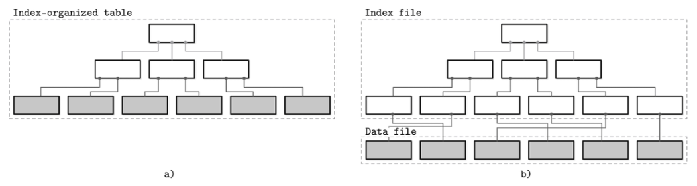
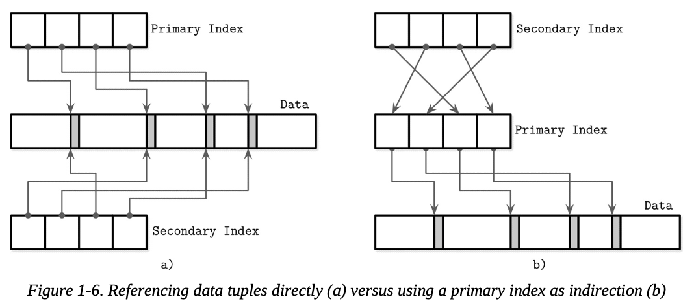

## Column- Versus Row-Oriented DBMS

- 대부분의 DBMS는 데이터를 행(row)과 열(column)로 구성된 테이블 구조로 저장함
- 필드(Field)
  - 하나의 필드 = 하나의 셀
  - 열과 행이 만나는 지점에 존재하는 단일 값
  - 예: (row → 3, column → name) = “홍길동”
- 열(Column)
  - 같은 열에 속한 필드들은 항상 같은 데이터 타입을 가져야 함
  - 예: name 열 → 모든 값이 문자열
- 행(Row)
  - 한 행은 하나의 엔티티/레코드를 나타냄
  - 각 열의 값을 모아서 하나의 객체나 실체를 표현
  - 이때 ‘키’는 이 객체와 실체를 식별하게 해줌
- 데이터베이스를 구분하는 주요 기준 중 하나는 디스크에 데이터를 어떻게 배치하는가임
- 두 가지 대표적인 저장 방식이 존재함
  - 행 기반 저장(row-wise): 같은 행의 모든 필드를 함께 저장
  - 열 기반 저장(column-wise): 같은 열의 모든 값을 함께 저장
- 테이블 분할 방식 설명
  - 수평 분할(horizontal partitioning) = row-wise
  - ex: 한 학생의 이름, 생년월일, 전화번호가 한 덩어리로 저장됨
  - 수직 분할(vertical partitioning) = column-wise
  - ex: 모든 학생의 이름만 따로, 생년월일만 따로 저장됨
- row-wise DBMS에는 MySQL, PostgreSQL 등 대부분의 전통적인 RDBMS 등이 속함.
  - 보통 이게 디폴트임
- column-wise DBMS에는 MonetDB, C-Store 등이 있음
  - 처음 들어보긴 했는데, 분석 쿼리 성능을 위해 사용된다고 함

### Row-Oriented Data Layout

- 행 지향 DBMS의 저장 구조는 표 형태와 거의 동일
  - 하나의 행 = 하나의 레코드 = 하나의 사용자, 상품, 주문 등
  - 각 행은 여러 필드(속성)를 가지며 고유 식별자(키)에 의해 구분됨
- 작동 방식
  - 전체 레코드 단위로 자주 읽고 씀
  - ex: 사용자의 모든 정보를 조회하거나, 한 번에 등록하는 경우
  - 레코드 전체를 디스크 블록 단위로 함께 저장하면, 디스크 접근 횟수가 줄고 성능이 높아짐
  - 단일 필드만 수정할 수도 있지만, 저장은 여전히 레코드 단위로 이뤄짐
- 성능상 이점
  - 디스크는 블록 단위 I/O를 하므로, 한 행의 모든 필드가 함께 저장되어 있으면 한 번의 디스크 접근으로 모든 정보를 가져올 수 있음
  - 이를 공간 지역성(spatial locality)이라고 부름 → 한 데이터 근처에 다른 필요한 데이터도 함께 위치한다는 뜻
- 장점: 행 단위 접근인 경우
  - ex: 사용자 전체 정보를 로딩하는 경우
    - 매우 효율적. 블록 하나에 그 사용자 전체 정보가 들어있음
- 단점: 특정 열만 필요한 경우 비효율적임
  - ex: 전체 사용자 중 전화번호만 쿼리할 때
    - 전화번호뿐 아니라 이름, 생년월일 등 불필요한 필드까지 함께 로딩됨
    - 메모리와 디스크 I/O 낭비 발생

### Column-Oriented Data Layout

- 열 지향 DBMS는 데이터를 열 단위로 연속 저장
  - 같은 열에 속한 값들을 한꺼번에 모아서 디스크에 연속적으로 저장
  - 반대로, 같은 행의 필드들은 서로 떨어진 위치에 저장됨
- 장점
  - 특정 열만 조회하는 쿼리에서 매우 효율적
    - 예: 주가 데이터 중 ‘가격’ 열만 수천만 건 조회하는 경우
    - 가격 정보만 한 번에 연속적으로 읽으면 되므로 디스크 I/O 최소화 가능
  - 행 단위 저장 방식에서는 전체 행을 읽고 나서 원하는 열만 골라야 했음 → 낭비 발생
  - 열 기반 저장 방식은 분석 쿼리, 집계 쿼리, 즉 분석 / 통계 목적인 OLAP( ↔ OLTP) 환경에 특히 적합
    - ex: 평균, 합계, 최대값 등 한 열 전체에 대해 계산하는 작업
- 분석 쿼리에서는 데이터를 **모아서 계산(aggregate)** 하는 것이 일반적
  - 예: 평균, 합계, 최대값, 추세 분석 등
- 논리적 레코드가 여러 필드를 가진 경우
  - 예: 주식 데이터 = 종목코드, 날짜, 가격 등
  - 이 중에서 **가격 정보**만 분석에 중요할 수 있음 → 특정 열만 집중적으로 조회
- 열 기반 저장 방식은
  - 중요한 열만 빠르게 조회 가능
  - 같은 열의 값들이 물리적으로 함께 있으므로, 연속적 읽기 및 벡터 연산(하나의 명령으로 여러 값을 병렬 처리)이 가능
  - 나머지 열을 로딩하지 않기 때문에 디스크 I/O 및 메모리 사용 최소화
- 가령 주식 시장 가격 정보의 경우 논리적으로는 여전히 행(row) 중심의 테이블 구조
  - 사용자가 데이터를 볼 때는 더 친숙한 SQL 테이블 형식
  - 각 행은 하나의 종목 정보로 구성됨
- 그런데 물리적 저장 방식은 완전히 다름
  - **c**olumn-oriented DBMS는 같은 열의 값을 물리적으로 함께 저장
  - 예: 종목만 따로 저장된 배열, 날짜만 따로 저장된 배열, 가격만 따로 저장된 배열
- 즉, 논리적 표현은 같더라도 물리적 구조(열 단위 저장)는 다를 수 있다는 것
- column-store는 각 열을 따로 저장하기 때문에…
  - **여러 열의 값을 조합하여 원래의 행(tuple)을 재구성**해야 할 때가 있음
  - 예: SELECT name, salary WHERE age > 30 같은 쿼리 → 여러 열의 값을 조합해야 함
- 이를 위해 각 열의 값이 어떤 행에 속하는지 추적할 수 있어야 함
  - 일반적인 방법: 각 값에 명시적인 키(ID)를 포함
    - 단점: 각 값에 ID가 붙으면 중복 발생, 스토리지 증가
- 최적화된 방법: 암시적 식별자 (virtual ID) 사용
  - 각 열의 값이 배열 형태로 저장되어 있고, **위치(인덱스)**가 같으면 같은 행으로 간주
  - 예: name[3], age[3], salary[3] → 같은 사람의 정보로 연결
  - 이 방식은 추가 저장 공간 없이도 관계 유지 가능 → 효율적임
- 최근 몇 년 간 대규모 분석 수요가 늘어나면서 열 지향 포맷 및 열 지향 저장소 다수 등장

### Distinctions and Optimizations

- 단순히 “row-store는 행 단위 저장, column-store는 열 단위 저장”이라는 데이터 저장 방식 기반의 설명으로는 이 둘을 구분하기에 충분치 않음
  - 데이터 저장방식은 열 기반 저장소의 최적화 방식 중 하나
  - 그 외에도 열 기반 저장소만의 다양한 최적화 전략이 존재함
- 장점 1. 열 단위 연속 데이터 접근
  - 같은 열의 값들이 물리적으로 인접하게 저장되어 있음
  - 따라서 CPU가 연속적으로 데이터를 읽을 수 있고, 이 과정에서 캐시 적중률이 높아짐
  - 캐시 효율이 좋아지면 전체 메모리 접근 횟수가 줄어들고, 성능이 향상됨
- 장점 2. 벡터화된 명령어를 현대 CPU는 벡터 명령어(SIMD)를 지원
  - 같은 연산을 여러 데이터에 동시에 적용할 수 있음
    - 예: 평균 계산, 필터 조건 비교, 정규화, 변환 등
  - column-store는 이 구조에 잘 맞기 때문에 CPU 연산 최적화에도 유리함
- 장점 3: 압축
  - column-store에서는 **하나의 열이 하나의 데이터 타입**으로 구성됨
    - 예: 가격 열은 float, 이름 열은 string
  - 이처럼 동일한 타입의 값들이 연속적으로 저장됨
  - 이 구조는 압축에 매우 유리
    - 같은 데이터 타입이면 **패턴이 일정** → 각 데이터 타입에 맞는 압축 알고리즘 선택 가능
- row-store와 column-store 중 선택 기준? → 데이터 엑세스 패턴 고려
- row-store가 유리한 경우
  - 사용자가 한 번에 전체 레코드를 읽을 때
  - 즉, 대부분의 열을 함께 요청하는 쿼리
  - 예: SELECT \* FROM users WHERE id = 42
  - 주로 포인트 쿼리 (하나의 키로 한 레코드 검색), 범위 스캔 (예: 날짜 구간 검색)
- column-store가 유리한 경우
  - 많은 행을 스캔하면서 특정 열만 조회할 때
  - 예: SELECT AVG(price) FROM sales WHERE region = 'East'
  - 이런 경우 열만 읽고, 나머지 필드는 아예 접근하지 않아도 됨 → 효율적

### Wide Column Stores

- Wide Column Store ≠ Column-Oriented Store
  - 이름은 비슷하지만 구조와 목적이 완전히 다름
  - 대표적인 예: Google Bigtable, Apache HBase
- 구조적으로는 2단계 맵처럼 작동
  - 상위 키 (ex: URL, 사용자 ID …) → 하위 키-값 쌍의 맵
  - 이때 하위 키는 컬럼 이름, 값은 그에 해당하는 데이터
- 행 키(row key)
  - 하나의 레코드(논리적 행)를 식별하는 **기본 키 역할**
  - **정렬 순서에 큰 영향**을 미침 → 스캔 최적화에 중요
  - 일반적으로 역순 URL(그래야 같은 도메인끼리 가까이 위치), 사용자 ID, 타임스탬프 등을 사용
- 컬럼 키
  - 컬럼 패밀리 이름
- 컬럼 패밀리
  - 서로 관련있는 컬럼들을 묶은 것
  - RDBMS의 테이블과 비슷해보임. 하지만 각 행이 가질 수 있다는 컬럼의 수, 이름이 다를 수 있다는 것이 가장 큰 차이점
  - 컬럼 패밀리 단위로 ‘물리적으로 분리되어 저장 (분산 저장)’ → 이를 partition key라 함
  - → 그래서 column-oriented처럼 보일 수 있지만 partitioned row store (저장 자체는 row 단위. 즉 row store) 기반 column family 모델이라고 보는 것이 맞음.
- 용도
  - 키 기반 접근에 특화
  - URL, 사용자 ID 등으로 빠르게 조회할 수 있어야 하는 대규모 데이터
- Webtable 예시
  - 역순 URL → 타임스탬프 키 (스냅샷 용도) → 컬럼 패밀리

```
Webtable = {
  "com.cnn.www": {
    "2021-01-01": {
      "contents": "<html>...</html>",
      "anchors": ["com.nytimes.www", "com.bbc.www"]
    },
    "2021-02-01": {
      "contents": "<html>Updated...</html>",
      "anchors": ["com.nytimes.www"]
    }
  },
  "com.nytimes.www": {
    "2021-01-01": {
      "contents": "<html>News...</html>",
      "anchors": []
    }
  }
}
```

- 키 기반 빠른 조회 → 계층적인 인덱싱으로 인해 특정 키(URL, 스냅샷)에 해당하는 데이터에 빠르게 접근 가능
- 유연한 스키마를 가지면서도 row 기반 저장방식을 가짐

## Data Files and Index Files

- DBMS vs 그냥 여러 개의 파일 쓰기 → DBMS 더 나은 이유는?
- 세 가지 주요 효율성
  - **저장 효율성**: 데이터 저장 공간 낭비를 줄이는 구조
  - **접근 효율성**: 원하는 데이터를 빠르게 찾을 수 있도록 설계됨 (예: 인덱스 구조 사용)
  - **갱신 효율성**: 데이터를 변경할 때 디스크의 변경량을 줄여 성능을 높이고 리스크를 낮춤
- 데이터는 테이블 단위로 저장되며, 실제 파일은 테이블 단위로 나뉨
- 하나의 레코드는 여러 개의 필드(컬럼)로 구성됨
- 레코드를 찾을 때 전체 테이블을 다 뒤지지 않도록 인덱스를 사용함
- 인덱스(index)는 책의 색인과 비슷한 개념으로, 찾고자 하는 정보를 빠르게 찾기 위한 구조
- 인덱스는 테이블의 모든 필드를 사용하지 않고, 식별자 필드를 기반으로 구축됨

---

- 데이터 저장소는 1) 데이터를 직접 담고 있는 데이터 파일과 2) 데이터를 빠르게 찾기 위한 인덱스 파일로 나뉨
- 인덱스 파일은 위치 정보(메타데이터)만 담고 있으므로 상대적으로 크기가 작음
- 실제 저장 단위는 페이지 단위이며, 페이지는 디스크 블록 크기 배수에 맞춰 설계됨
- 페이지 구성 방식은 단순한 레코드 배열 방식 또는 슬롯 페이지 기반 방식이 있음
  - 슬롯 페이지는 가변 길이 레코드를 효율적으로 관리할 수 있는 구조로, 뒤에서 설명
- 데이터 삽입과 갱신은 모두 키/값 형태로 처리됨.
  - 삭제는 실제 데이터를 지우지 않고, 삭제 표시를 남기는 방식으로 처리됨
- 삭제 마커(tombstone)는 해당 레코드가 더 이상 유효하지 않다는 것을 나타냄
  - 삭제되어 삭제 마커로 가려졌거나(shadowed) 또는 갱신으로 인해 안 쓰이는 공간은 GC을 통해 정리됨
  - 또 유효한(unshadowed) 레코드를 새 위치에 기록함
  - 이 과정은 읽기 성능을 유지하면서 디스크 공간을 효율적으로 사용하기 위한 전략임

### Data Files

- 데이터 파일(primary file)은 세 가지 방식으로 구현될 수 있음
  - Heap File
    - 단순 저장. 삽입 순서대로 저장
    - 쓰기 빠름
    - 조회 느림
    - 검색을 위해 반드시 인덱스 필요. 그렇지 않으면 모든 데이터를 순차 탐색하므로 O(n)
  - Hashed File
    - 키에 대한 해시를 통해 저장 위치 결정.
    - 포인트 조회 빠름
    - 범위 검색 느림
  - Index-Organized Table (IOT)
    - 인덱스가 데이터를 직접 담음
    - 쓰기 / 갱신 시 인덱스 유지해야 해서 느림
    - 키 순서로 정렬되어 있어서 범위 검색 빠름
    - Oracle에서 해당 기능을 제공함
- 차이
  - Heap, Hashed 방식은 데이터를 별도로 두고 인덱스로 참조
    - 즉 데이터 → 데이터 파일, 인덱스 → 인덱스 파일
    - 인덱스로 위치를 찾고 → 그 위치에서 데이터 조회. 2단계로 접근
    - 디스크 탐색 한번 더 필요하다는 단점
  - IOT는 데이터가 인덱스 구조 내부에 존재
    - 인덱스를 탐색하면서 바로 데이터 조회. 1단계 접근
    - 디스크 I/O 한번 덜 함. 이 덕분에 범위 스캔도 빠름
    - [http://www.gurubee.net/lecture/3261](http://www.gurubee.net/lecture/3261)

### Index Files

- 인덱스란?
  - 디스크에서 데이터 레코드를 빠르게 찾기 위한 자료구조
  - 핵심 기능은 “키 → 위치” 매핑
- 인덱스의 종류
  - 기본 인덱스 (Primary Index): 주로 기본 키(primary key)를 기준으로 구성됨. 하나만 가능
  - 보조 인덱스 (Secondary Index): 그 외 나머지 모든 인덱스
- 보조 인덱스 구현 방식
  - 데이터 레코드로 직접 포인터를 가질 수도 있고…
  - 기본 키만 저장해서 다시 기본 인덱스를 통해 찾아가는 간접 참조 방식도 있음
- 클러스터형 vs 넌클러스터형
  - 클러스터형 인덱스: 데이터 자체가 키 순서에 맞게 저장됨 → 순차 접근(or 범위 스캔)에 유리 (즉 인덱스 순서와 물리적 저장 순서가 일치)
  - 넌클러스터형 인덱스: 데이터 순서와 무관하게 저장되고, 인덱스는 참조 역할만 함
- 데이터베이스 성능 영향
  - 검색 성능을 높이려면 어떤 속성에 인덱스를 걸지, 그리고 그것을 클러스터링할지 고민해야 함
  - 다중 인덱스가 존재할 수 있으므로, 쿼리 특성에 따라 인덱스 설계 전략이 달라짐
- 알아두면 좋은 거
  - 보통 RDBMS에서 기본 인덱스는 클러스터형, 보조 인덱스는 넌클러스터형임
  - MySQL InnoDB는 기본 키 기준으로 데이터를 정렬하여 저장함 (클러스터형)



- IOT와 인덱스 파일이 헷갈릴 수도 있음.
  - IOT는 데이터를 인덱스 안에 ‘키 순서대로’ 저장 → 정의에 따라 클러스터형 인덱스
  - 즉 별도 데이터 파일 없이 인덱스 자체가 데이터 저장소 역할 수행함
- 기본 vs 보조 / 클러스터 vs 넌클러스터
  - 기본 인덱스 → ‘대부분’ 클러스터형. 보통 기본 키에 따라 데이터를 정렬하여 저장하기 때문
  - 보조 인덱스 → 넌클러스터형. 기본 키가 아닌 다른 키를 통해 접근을 도움
- 따라서…
  - **클러스터형 → IOT 혹은 인덱스 / 데이터 파일 분리 구조 둘 다 가능함** \*\*
- **기본 키 존재 여부**
  - 많은 DBMS는 테이블에 기본 키를 **명시적으로 요구**함
    - 기본 키가 없을 경우 암시적인 키를 자동으로 생성 (예: MySQL은 auto_increment 키 추가)
  - DB마다 이 개념에 대응되는 용어 존재
    - 관계형 DB (MySQL, PostgreSQL): 전통적인 인덱스 구조 그대로 사용
    - NoSQL (Cassandra, Riak): 다소 다른 내부 구조지만, 유사 개념 존재
    - 문서형 DB (MongoDB): \_id 필드를 기본 키로 사용하고, 보조 인덱스 존재

### Primary Index as an Indirection

- 데이터 레코드 참조 방식에 대한 두 가지 접근
  - 직접 참조 (Direct Reference)
    - 보조 인덱스에서 바로 데이터의 디스크 위치(오프셋)를 가리킴
    - 장: 디스크 탐색이 한 번이면 끝나므로 빠름
    - 단: 데이터 위치가 바뀌면 오프셋도 바뀌므로, 모든 포인터 업데이트 필요
  - 간접 참조 (Indirect Reference)
    - 보조 인덱스는 기본 키만 보유 → 기본 인덱스를 통해 실제 데이터 조회
    - 장: 레코드 위치가 바뀌어도 기본 키는 유지되므로 포인터 갱신이 필요 없음
    - 단: 항상 인덱스를 두 번 조회해야 하므로 읽기 성능에서 손해
- 인덱스가 많을수록 간접 참조가 유리
  - 직접 참조 방식은 인덱스가 많으면 업데이트 시 포인터 수정 비용이 큼
  - 간접 참조는 이러한 유지비용을 줄여주지만, 쿼리 속도는 느려질 수 있음
- MySQL InnoDB는…
  - 보조 인덱스는 실제 데이터 오프셋이 아닌 기본 키만 저장
  - 데이터 조회 시 보조 인덱스로 기본 키를 찾고, 다시 기본 인덱스를 통해 데이터 찾음
  - 즉, 항상 두 번 조회해야 함
- 결국은 트레이드오프임
  - 읽기 성능 중요하면 → 직접 참조
  - 인덱스 많거나 쓰기 성능 중요하면 → 간접 참조
- 하이브리드 방식도 있음
  - 데이터 파일 오프셋과 기본 키를 모두 저장
  - 데이터 오프셋이 유효한지 확인 → 변경되었다면 기본 키 인덱스를 한번 더 타고 + 새 오프셋으로 갱신



## Buffering, Immutability, and Ordering

- 스토리지 엔진은 특정 자료구조를 기반으로 함
  - 하지만 이건 데이터를 저장하고 검색하는 틀이기만 함
  - 하지만 스토리지 엔진이 지원하는 캐싱 / 복구 / 트랜잭션 같은 기능은 이 자료구조와 별개임
  - 일단은 이 자료구조만 이해해 보자
- 스토리지 엔진의 핵심 속성 3가지: 버퍼링, 불변성 (가변성), 정렬성
- 버퍼링
  - 버퍼링이란?
    - 디스크에 데이터를 바로 쓰지 않고, 메모리에 일정량 모아둔 후 한꺼번에 쓰는 전략
  - 필수적 버퍼링
    - 대부분의 구조에서 어느 정도 쓰이긴 함
    - 디스크는 데이터를 블록 단위로 처리하기 때문에, 블록을 채워서 쓰는 것이 효율적임
    - 이건 불가피한(필수적) 버퍼링
  - 그러나 여기서 말하는 건 선택적 버퍼링(avoidable buffering)
    - 설계자가 명시적으로 더 많은 데이터를 모아서 쓰기로 선택하는 것
    - 왜? → 디스크 IO를 줄여서 최적화를 하기 위함임
    - ex: Lazy B-Tree는 B-Tree 노드에 추가 메모리 버퍼를 둬서, 디스크 쓰기를 지연시키고 모아서 처리함
  - B-Tree의 메모리 버퍼가 버퍼링의 유일한 방식 아님. Two-component LSM Tree만의 방식도 있음
    - B-Tree와는 완전히 다른 방식이고, 불변성과 관련 있음. 나중에 챕터 7에서 설명
- 불변성 (가변성)
  - 가변 구조 (Mutable)
    - 기존 데이터를 그 자리에 덮어쓰는 방식
    - 예: B-Tree는 기존 노드를 찾아서, 그 자리에서 값 변경
  - 불변 구조 (Immutable)
    - 기존 내용을 수정하지 않고, 변경된 내용을 새로운 위치(끝)에 추가로 기록
    - 예1: 복사 후 쓰기 (Copy-on-Write)
      - 업데이트된 내용을 원래 위치 대신 다른 장소에 복사하여 저장
      - 이후 새로운 버전만 참조하게 만듦 → 트랜잭션 일관성 유지에 유리
    - 예2: Bw-Tree
      - LSM 트리와 B 트리의 차이가 불변 vs 제자리 업데이트(가변)으로 많이 설명됨
      - 하지만 B 트리 파생 구조 중 Bw-Tree는 불변성을 가짐 → 어떻게 하는지는 뒤에서 다룸
- 정렬성
  - 정의?
    - 키 값이 비슷한 데이터들을 디스크 상에서도 물리적으로 **가까운 위치에 저장**
    - ex: B-Tree의 기본 인덱스는 클러스터 인덱스 → 기본 키에 따라 물리적으로 정렬된 상태로 저장
  - **정렬의 장점**:
    - 개별 데이터 레코드를 잘 찾는 것도 있지만…
    - 범위 검색(range scan)에서도 매우 유리 (예: WHERE key BETWEEN 100 AND 200)
    - **순차 I/O**를 활용할 수 있어서 성능 향상
  - 비정렬 저장
    - 키 순서와는 무관 → 정렬이 필요할 경우, 나중에 별도로 처리
    - 대신 쓰기에 유리
      - 순차적으로 파일 끝에 쓰기만 하면 되므로 **쓰기 속도 빠름**
      - 디스크 쓰기를 최소화할 수 있음
    - ex: Bitcask, WiscKey → 데이터를 append-only file에 저장

## Summary

- **DBMS 아키텍처** 소개
  - 클라이언트-서버 모델, 쿼리 처리 흐름, 저장소 컴포넌트 등
- **디스크 vs 메모리 기반 DB 비교**
  - 각각의 목적과 구조 차이
  - 디스크 구조는 두 경우 모두에서 **필요**
- **컬럼 지향 vs 로우 지향 저장 방식**
  - 데이터의 저장 방식이 엑세스 메서드과 **성능**에 미치는 영향
- **데이터/인덱스 파일 구조**
  - DBMS가 별도 구조를 가지는지? → 파일 시스템 대비 장점
- **핵심 개념 3가지 소개**
  - **버퍼링**: 쓰기 효율
  - **불변성**: 안정성, 동시성
  - **정렬성**: 검색 효율
  - 이 세 개념을 다양한 자료구조에 적용해가며 설명할 예정
